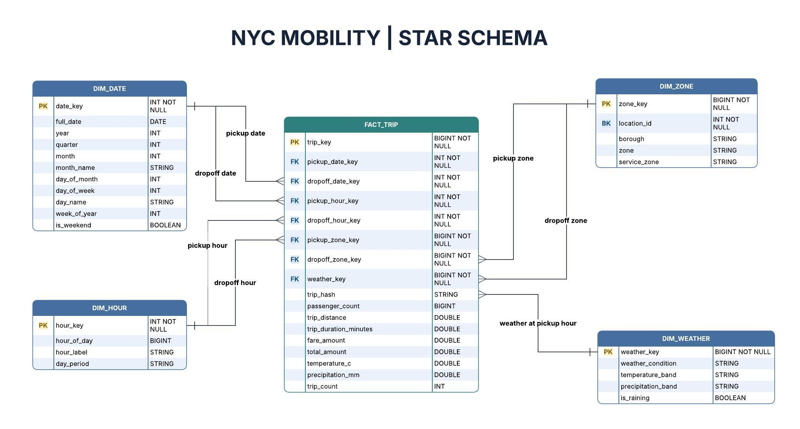

# NYC Mobility Gold Star Schema

### Overview

The Gold layer uses one trip fact table and four dimensions. It supports analysis of NYC Green Taxi trips by pickup or dropoff date, hour, zone, and weather at pickup.

### Table grain

| Table | One row represents | Primary key |
| --- | --- | --- |
| `fact_trip` | One valid NYC Green Taxi trip | `trip_key` |
| `dim_date` | One calendar date found in valid pickup or dropoff data | `date_key` |
| `dim_hour` | One hour of the day; 24 rows total | `hour_key` |
| `dim_zone` | One NYC TLC taxi zone | `zone_key` |
| `dim_weather` | One distinct combination of descriptive weather attributes | `weather_key` |

### Fact table: `fact_trip`

Each trip has separate dimension keys for its pickup and dropoff:

| Foreign key | Dimension | Role |
| --- | --- | --- |
| `pickup_date_key` | `dim_date` | Pickup date |
| `dropoff_date_key` | `dim_date` | Dropoff date |
| `pickup_hour_key` | `dim_hour` | Pickup hour |
| `dropoff_hour_key` | `dim_hour` | Dropoff hour |
| `pickup_zone_key` | `dim_zone` | Pickup zone |
| `dropoff_zone_key` | `dim_zone` | Dropoff zone |
| `weather_key` | `dim_weather` | Weather associated with the pickup hour |

The fact table contains these measures: `passenger_count`, `trip_distance`, `trip_duration_minutes`, `fare_amount`, `total_amount`, `temperature_c`, `precipitation_mm`, and `trip_count`.

### Dimensions

- **`dim_date`:** Full date, year, quarter, month, month name, day of month, day of week, day name, week of year, and weekend flag.
- **`dim_hour`:** Hour of day, hour label, and day period.
- **`dim_zone`:** TLC `location_id`, borough, zone, and service zone.
- **`dim_weather`:** Weather condition, temperature band, precipitation band, and rain flag.

### How to query the model

- Count trips with `COUNT(*)` or `SUM(trip_count)`.
- Use the **pickup** or **dropoff** key that matches the question. For example, use `pickup_zone_key` to group trips by pickup zone.
- Use `dim_weather` for weather categories. Use `fact_trip.temperature_c` and `fact_trip.precipitation_mm` for numeric weather analysis.
- When joining the same dimension for pickup and dropoff, use separate aliases such as `pickup_zone` and `dropoff_zone`.

### Weather Matching

Taxi trips are matched to hourly weather using the pickup time.

The pickup timestamp is truncated to the hour and joined to the corresponding Silver weather observation. The resulting `weather_key` links the trip to `dim_weather`, while exact `temperature_c` and `precipitation_mm` values are retained in `fact_trip`.

Gold validation requires `weather_key` to be non-null and verifies referential integrity against `dim_weather`.
